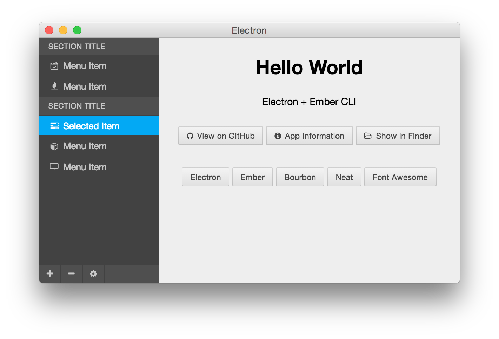

# Ember + Electron + Bourbon + Neat

Experimenting with Ember CLI and Electron for creating desktop applications.

## Prerequisites

You will need the following things properly installed on your computer.

* [Git](http://git-scm.com/)
* [Node.js](http://nodejs.org/) (with NPM)
* [Bower](http://bower.io/)
* [Ember CLI](http://www.ember-cli.com/)
* [PhantomJS](http://phantomjs.org/)

## Installation

* `git clone <repository-url>` this repository
* change into the new directory
* `npm install`
* `bower install`

## Running / Development

* `npm start`

You may need to reload the page in the app if the Ember server doesn't start up fast enough.

### Code Generators

Make use of the many generators for code, try `ember help generate` for more details

### Running Tests

* `ember test`
* `ember test --server`

### Building

TODO: Add build tools for building the Electron app and the Ember app within.

## Further Reading / Useful Links

* [electron](http://electron.atom.io)
* [ember.js](http://emberjs.com/)
* [ember-cli](http://www.ember-cli.com/)
* [ember inspector](https://chrome.google.com/webstore/detail/ember-inspector/bmdblncegkenkacieihfhpjfppoconhi)
